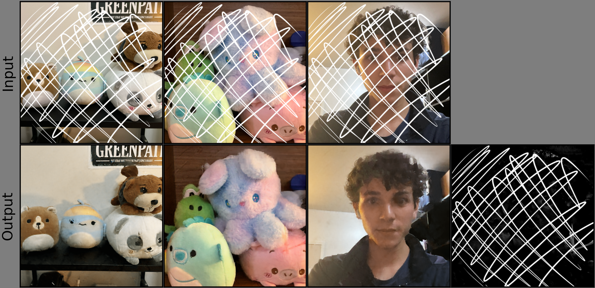

# Double-DIP

## Overview
This is the code for my implementation of the Double-DIP framework that I made as a final project for CS 166 at Caltech. The DIP implementation is in `dip.py` and the various Python files contain the code for using DIP/Double-DIP to perform denoising, inpainting, segmentation, transparency separation, and watermark removal. This project was based on [Gandelsman et al., 2018](https://arxiv.org/abs/1812.00467) and [Ulyanov et al., 2017](https://arxiv.org/abs/1711.10925).

## Results
My full report for this project is in [`report.pdf`](report.pdf). The Double-DIP framework can be used for a wide variety of tasks. The image shown below is an example of watermark removal, where the top row of images are given as inputs and the outputs are in the bottom row. More results are shown in the report.



## Replicating results

To generate all images from the report, the commands listed below were run. After this, `create_plots.py` can be run to generate the figures exactly they are shown in the report. Note that the DIP/Double-DIP output will be different every time and some commands may need to be run a few times before optimal results are achieved.

### Denoising

```bash
python3 denoising.py images/apple.jpg output/denoising-15 --noise 0.15 --no-verbose &
python3 denoising.py images/apple.jpg output/denoising-30 --noise 0.30 --no-verbose &
python3 denoising.py images/apple.jpg output/denoising-50 --noise 0.50 --no-verbose &
python3 denoising.py images/apple.jpg output/denoising-80 --noise 0.80 --no-verbose &
```

### Inpainting

```bash
python3 inpainting.py images/apple.jpg output/inpainting-15 --remove_percent 15 --no-verbose &
python3 inpainting.py images/apple.jpg output/inpainting-30 --remove_percent 30 --no-verbose &
python3 inpainting.py images/apple.jpg output/inpainting-50 --remove_percent 50 --no-verbose &
python3 inpainting.py images/apple.jpg output/inpainting-80 --remove_percent 80 --no-verbose &
```

### Segmentation

```bash
python3 segmentation.py images/apple.jpg output/segmentation-0/ --mask_coeff 999999 --no-verbose &
python3 segmentation.py images/apple2.png output/segmentation-1/ --no-verbose &
python3 segmentation.py images/shoe.png output/segmentation-2/ --mask_coeff 999999 --no-verbose &
python3 segmentation.py images/cats.jpg output/segmentation-3/ --mask_coeff 999999 --no-verbose &
```

### Transparency Separation

```bash
python3 transparency_separation.py images/curry-balloon output/transparent-0/ --noise 0.2 --no-verbose &
python3 transparency_separation.py images/strange-hamster output/transparent-1/ --noise 0.2 --no-verbose &
python3 transparency_separation.py images/strange-hamster-single output/transparent-2/ --no-verbose &
```

### Watermark Removal

```bash
python3 watermark.py images/watermark output/watermark-0 --no-verbose &
python3 watermark.py images/watermark2 output/watermark-1 --no-verbose &
python3 watermark.py images/watermark3 output/watermark-2 --no-verbose &
python3 watermark.py images/watermark_vecteezy/ output/watermark-3 --mask_coeff 0 --no-verbose &
```
